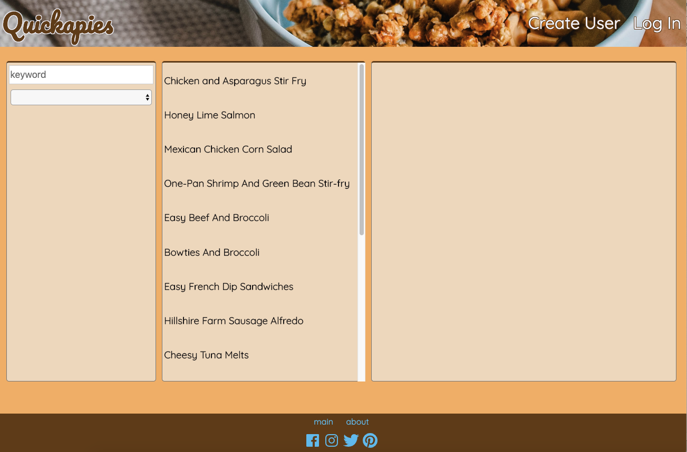
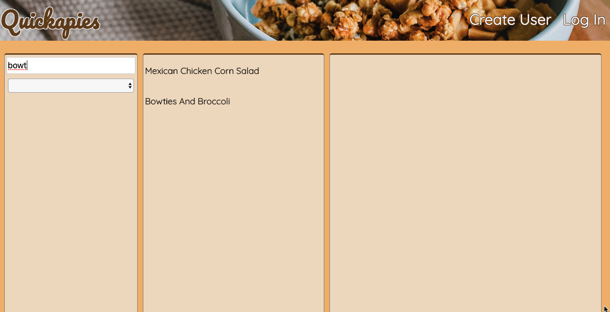
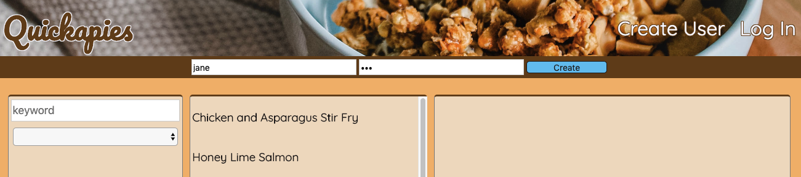
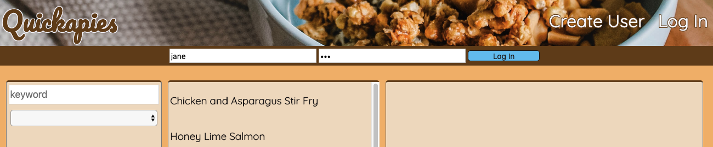
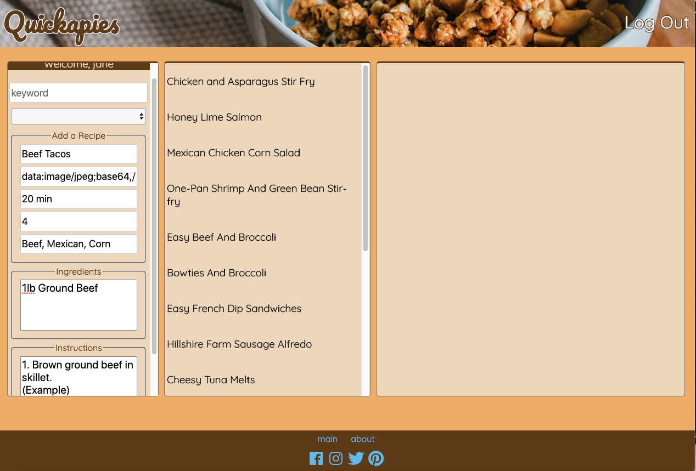
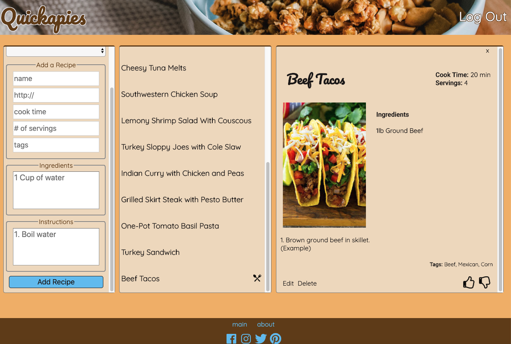
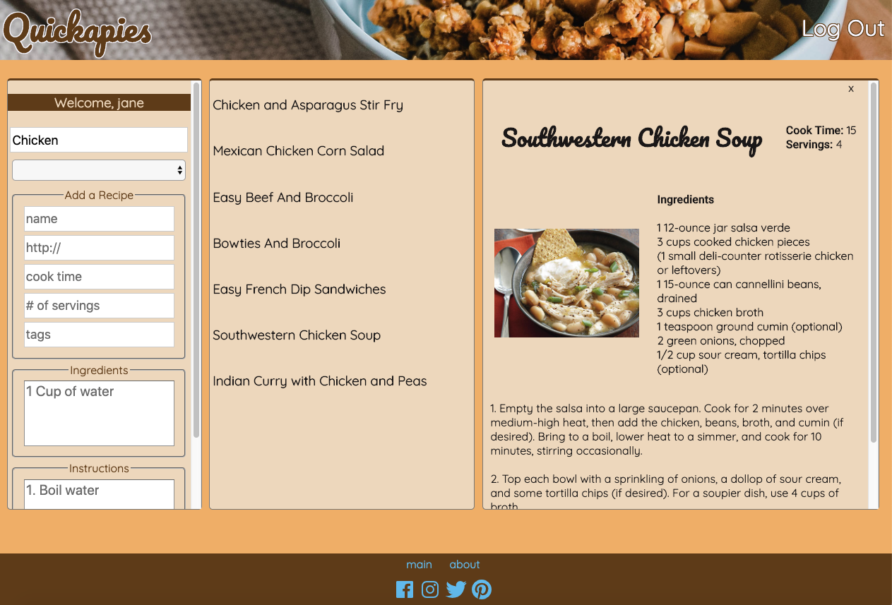

# Quickapies
> create, search, and sort through a collection of quick recipes

## Table Of Contents
* [Introduction](#introduction)
* [Collaborators](#collaborators)
* [Technologies](#technologies)
* [Dependencies](#dependencies)
* [Illustration](#illustration)
* [Scope of Functionalities](#scope-of-functionalities)
* [Examples of Use](#examples-of-use)
* [Unsolved Problems](#unsolved-problems)
* [Project Status](#project-status)
* [References](#references)

## Introduction
Quickapies is a recipe app which allows a user to search through a database of recipes that take less than 30 minutes of total time to prepare. We decided to develop Quickapies for people who don't have much time to cook or prepare meals, but would like access to a variety of recipes that fit into any busy schedule.

## Collaborators
* Becka Catanzaro
* Yulli Chong
* Carramah Quiett

## Technologies
* HTML / CSS
* JavaScript
* AngularJS
* MongoDB
* GitHub
* Heroku

## Dependencies
* bcrypt - version 3.0.6
* dotenv - version 8.0.0
* Express - version 4.17.1
* Express-Session - version 1.16.2
* Mongoose - version 5.6.9

## Illustration

## Scope of Functionalities
* Flexible design: mobile view vs browser view.
* Anyone can access the recipe database and filter it using the search bar.
* Anyone can click on a recipe name and pull up the corresponding recipe card.
* Anyone can create a username and password, and use it to log in.
* Only users can add new recipes.
* Only the user who created a particular recipe can edit or delete it.
* Only users can "like" or "dislike" a recipe.

## Examples of Use
* Anyone can search for a recipe.

* If you don’t have an account, create a user – click on “Create User” and enter a username and password.

* Click on “Log In” to enter your username and password.

* After logging in, Quickapies takes you to the welcome screen where the logged in user can add, edit, and delete their own recipe.

* Use the search bar to search for a recipe.

## Unsolved Problems
* Adding a free API which allows the user to search through a wider base of recipes.
None of the free APIs had instructions available to display on our app; all of them simply gave a link to redirect the user to a different website where the instructions were available.
Goal: Find a free API with access to all information needed to make a recipe card on the app.

* Ability to Like/Dislike a recipe.
Currently, a user who logs in is able to click on "like" and "dislike" on any given recipe, and the data will be added and saved. However, there is currently no limit to the number of times a user is able to like and dislike a recipe.
Goal: When a user clicks "like" or "dislike" one time, their vote will be counted, and they will not be able to add a second "like" or "dislike".
Goal: When a user who has already clicked "like" or "dislike" clicks on the "like" or "dislike" button, their vote will then be removed and they will be able to cast it again.

## Project Status
This project is still in progress.
* Note: improve log in system so that attempting to log in with a username and password that do not match, the user is presented with some sort of notification.
* Note: improve log in system so that a user attempting to create a username that has already been taken will receive some sort of notification.

## References
* GA Notes
* BULLDOGJOB: https://bulldogjob.com/news/449-how-to-write-a-good-readme-for-your-github-project
* Plunker: http://plnkr.co/edit/XklvXtc1AZpndjLvXrh8?p=preview
